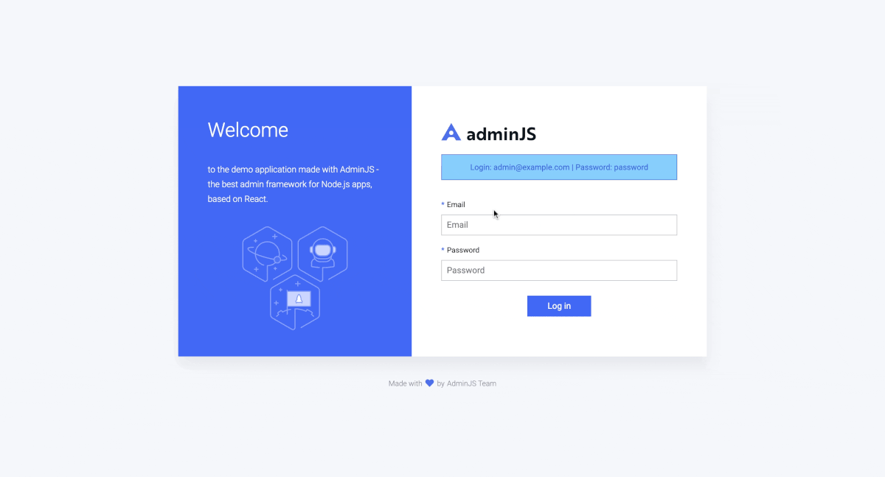

# AdminJS


AdminJS is an open-source admin panel for your Node.js application. It does not force it's database schema upon your application; instead, it integrates with your Node.js server and the ORM/ODM you are using.\
\
The UI components are written in React and you can fully customize the admin panel.\
AdminJS also generates it's own REST API which you can use outside of the admin panel or use it to integrate it with your other applications.



Visit [our demo](https://adminjs-demo.herokuapp.com/admin/login) for a live preview.\
\
&#x20;`Email: admin@example.com`\
&#x20;`Password: password`


An AdminJS panel can be easily integrated with your existing Node.js application due to a large number of supported frameworks:

* Express.js (via `@adminjs/express`)
* Nest.js (via `@adminjs/nestjs`)
* Hapi (via `@adminjs/hapi`)
* Koa (via `@adminjs/koa`)
* Fastify (via `@adminjs/fastify`)

AdminJS also does not force it's own database schema upon you. Instead, it supports a number of ORMs and ODMs to connect with your existing database:

* TypeORM (via `@adminjs/typeorm`)
* Sequelize (via `@adminjs/sequelize`)
* Mongoose (via `@adminjs/mongoose`)
* Prisma (via `@adminjs/prisma`)
* MikroORM (via `@adminjs/mikroorm`)
* Objection (via `@adminjs/objection`)

At the same time, you can fully customize the look of AdminJS panel. The user interface is built with React, similarly you can write your new React custom components to add new UI elements or override the existing ones.


Visit our [homepage](https://adminjs.co/) to find out more information about AdminJS and read our [case studies](https://adminjs.co/enterprise#case-studies).

