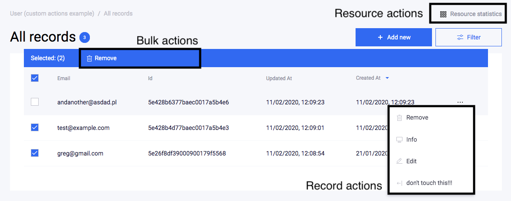

# Action

## Introduction

AdminJS has 7 major default actions defined for each resource. Every action that is present in AdminJS panel (be it a default or a custom action) also has an automatically generated REST API endpoint: `/resources/{resourceId}/actions/{action}`

All AdminJS actions can be categorised into:

* resource actions,
* record actions,
* bulk actions.

Resource actions can be accessed in the header of a content view in a given resource (above `Filter` button).

Record actions can be accessed either via a three-dot menu next to a record in the list or above the content in another record action.

Bulk-type actions appear in the list action's table header when you select at least one record.

<figure><figcaption><p>Default actions placement</p></figcaption></figure>

### Resource-type actions

Those are the actions which don't require `recordId` parameter, meaning they are related to your resource as a whole and not to a specific record.

* `list` is responsible for listing records under a resource as well as filtering them
* `search` allows you to search records in a given resource by a query string (by default it's the title property)
* `new` is responsible for creating a new record in a given resource

### Record-type actions

Those are the actions which require `recordId` parameter. They are related to a specific record.

* `show` is responsible for showing the details of a record
* `edit` allows you to modify a specified record
* `delete` is responsible for deleting single records

### Bulk-type actions

Those are the actions which require `recordIds[]` parameter which is a list of records' ids.

* `bulkDelete` removes all selected records from the database

## Customizing actions

Each default AdminJS action can be fully customized and you are also able to create your new custom [actions](https://adminjs.page.link/action-interface-code).

### Creating custom actions

Creating a new action in AdminJS is very simple. This can be achieved by simply adding a new action key into resource's options' `actions` configuration:

```typescript
const UserResource = {
  resource: User,
  options: {
    actions: {
      myCustomAction: {
        actionType: 'record',
        component: false,
        handler: (request, response, context) => {
          const { record, currentAdmin } = context
          return {
            record: record.toJSON(currentAdmin),
            msg: 'Hello world',
          }
        },
      },
    },
  },
}
```

Every custom action requires you to specify `actionType` which can be `record`, `resource` or `bulk`. You also must define a `handler` for your action. This is a backend method for fetching or processing your data. A single `handler` is used for both querying and mutating processes but you are able to differentiate these based on `request.method` (which is `post` or `get`).

The `handler` must return `records` in case of `bulk` or `resource` actions or `record` for `record` actions. You can return any additional information alongside `record`/`records`.

The last important option is `component`. This can either be `false` which means that the backend `handler` will be triggered once you press the button or you can provide your custom component that will be rendered.

#### Action with custom component


```jsx
import React from 'react'
import { Box, H3 } from '@adminjs/design-system'
import { ActionProps } from 'adminjs'

const MyCustomAction = (props: ActionProps) => {
  const { record } = props

  return (
    <Box flex>
      <Box variant="white" width={1 / 2} boxShadow="card" mr="xxl" flexShrink={0}>
        <H3>Example of a simple page</H3>
        <p>Where you can put almost everything</p>
        <p>like this:</p>
        <p>
          
        </p>
      </Box>
      <Box>
        <p>Or (more likely), operate on a returned record:</p>
        <Box overflowX="auto">{JSON.stringify(record)}</Box>
      </Box>
    </Box>
  )
}

export default MyCustomAction
```


Resource options code:

```typescript
const UserResource = {
  resource: User,
  options: {
    actions: {
      myCustomAction: {
        actionType: 'record',
        component: Components.MyCustomAction, // see "Writing your own Components"
        handler: (request, response, context) => {
          const { record, currentAdmin } = context
          return {
            record: record.toJSON(currentAdmin),
            msg: 'Hello world',
          }
        },
      },
    },
  },
}
```

In addition to the required configuration, you may also specify other optional options. They will be covered in the later parts of this section.

### Changing visibility and accessibility of an action

In AdminJS all actions are both accessible and visible by default. By saying that an action is visible, it means you can access it in the UI. An accessible action is an action which can be accessed via AdminJS API even if it is not visible.

You can change the visibility of an action by using `isVisible` option or change it's accessibility by using `isAccessible` option. Their configuration is the same, they can be just a boolean value:

```typescript
const UserResource = {
  resource: User,
  options: {
    actions: {
      edit: {
        isAccessible: false,
        isVisible: true,
      },
    },
  },
}
```

They can also be an `IsFunction` which allows you to access record's context:

```typescript
const UserResource = {
  resource: User,
  options: {
    actions: {
      edit: {
        isAccessible: (context) => {
          const { record, currentAdmin } = context
          
          // We are only allowing to edit records created by currently logged in user
          return record?.params?.createdByUserId === currentAdmin.id
        },
        isVisible: true,
      },
    },
  },
}
```

In case of `record` actions the accessibility and visibility checks are done in runtime, for example when loading a specific record. `Resource` actions' accessibility and visibility is evaluated when your AdminJS instance is created.

### Displaying a Filter button in your resource action

The `Filter` button which you may have noticed above the table of the default `list` action can also be shown on your own `resource` actions' pages. However, by default it is disabled. If you would like the `Filter` button to be present you should use `showFilter` option. The filters work exactly the same as in the `list` action - when you set them, they are appended to your browser's address and it is up to you to process assigned filters in your resource action's component.

The `showFilter` option can also be used to hide the filters for `list` action.

```typescript
const UserResource = {
  resource: User,
  options: {
    actions: {
      list: {
        showFilter: false,
      },
    },
  },
}
```

### Displaying a confirmation message when you press an action button

This is a feature which you might have seen when attempting to delete a record in AdminJS [demo application](https://adminjs-demo.herokuapp.com/admin/login). Once you press `Delete`, a browser's confirmation pop-up appears asking you to confirm the removal of a record. If you want a similar behaviour in your custom actions, you should use `guard` option.

```typescript
const UserResource = {
  resource: User,
  options: {
    actions: {
      myCustomAction: {
        actionType: 'record',
        component: false,
        handler: (request, response, context) => {
          const { record, currentAdmin } = context
          return {
            record: record.toJSON(currentAdmin),
          }
        },
        guard: 'doYouReallyWantToDoThis',
      },
    },
  },
}
```

The `guard` message goes through localization so you can use a translation key.

### Using "before" and "after" hooks

In addition to `handler` you can also define `before` and `after` hooks in your custom or existing actions. The `before` hook is triggered at the start of an action, before `isAccessible` and `handler`. `after` hook, in turn, is triggered at the end of an action.&#x20;

In the example below, we will use `before` hook in `list` action to set default filter that only shows `User` resource results which have `status` equal to `active`. Additionally, we will use `after` hook to `console.log` the `meta` property of the response returned by `handler`.

```typescript
const customBefore = (request, context) => {
  const { query = {} } = request
  const newQuery = {
    ...query,
    ['filters.status']: 'active',
  }
  
  request.query = newQuery
  
  return request
}

const customAfter = (originalResponse, request, context) => {
  console.log(originalResponse.meta)
  
  return originalResponse
}

const UserResource = {
  resource: User,
  options: {
    actions: {
      list: {
        before: [customBefore],
        after: [customAfter],
      },
    },
  },
}
```

The `before` and `after` options accept a list of `Before` and `After` functions. This means you can assign multiple `before`/`after` hooks to your action where their order is important because every hook uses the arguments that could have been modified by the previous ones.

`before` hook can also be used to add additional validation for example in your `edit` action:

```typescript
// other imports
import { ValidationError } from 'adminjs'

const validateForm = (request, context) => {
  const { payload = {}, method } = request
  
  // We only want to validate "post" requests
  if (method !== 'post') return request
  
  // Payload contains data sent from the frontend
  const { age = null, lastName = '' } = payload
  
  // We will store validation errors in an object, so that
  // we can throw multiple errors at the same time
  const errors = {}
  
  // We are doing validations and assigning errors to "errors" object
  if (!age || age < 18) {
    errors.age = {
      message: 'A user must be at least 18 years old',
    }
  }
  
  if (lastName.trim().length === 0) {
    errors.lastName = {
      message: 'Last name is required',
    }
  }
  
  // We throw AdminJS ValidationError if there are errors in the payload
  if (Object.keys(errors).length) {
    throw new ValidationError(errors)
  }
  
  return request
}

const UserResource = {
  resource: User,
  options: {
    actions: {
      edit: {
        before: [validateForm],
      },
    },
  },
}
```

The errors will now be highlighted in `edit` action's form.

### Showing record actions in a drawer

By default every record action is displayed on a new page. You can, however, display them in a drawer at the right side of the screen, similarly to how `Filters` drawer is opened. This can be achieved by using `showInDrawer` option:

```typescript
const UserResource = {
  resource: User,
  options: {
    actions: {
      myCustomAction: {
        actionType: 'record',
        component: Components.MyCustomAction, // see "Writing your own Components"
        handler: (request, response, context) => {
          const { record, currentAdmin } = context
          return {
            record: record.toJSON(currentAdmin),
          }
        },
        showInDrawer: true,
      },
    },
  },
}
```

### Nesting record actions in a context menu when there are too many of them

If you ever encounter a situation where you have defined a lot of custom record actions and they don't fit your screen width, using `parent` option can be a solution for you. This option allows you to set a name of a dropdown button which will group those actions under it.

```typescript
const UserResource = {
  resource: User,
  options: {
    actions: {
      myCustomAction: {
        actionType: 'record',
        component: false,
        handler: (request, response, context) => {
          const { record, currentAdmin } = context
          return {
            record: record.toJSON(currentAdmin),
          }
        },
        parent: 'More',
      },
      myOtherCustomAction: {
        actionType: 'record',
        component: false,
        handler: (request, response, context) => {
          const { record, currentAdmin } = context
          return {
            record: record.toJSON(currentAdmin),
          }
        },
        parent: 'More',
      },
    },
  },
}
```

In the example above, there are two custom actions: `myCustomAction` and `myOtherCustomAction` which both are grouped under `More` dropdown button.

&#x20;
